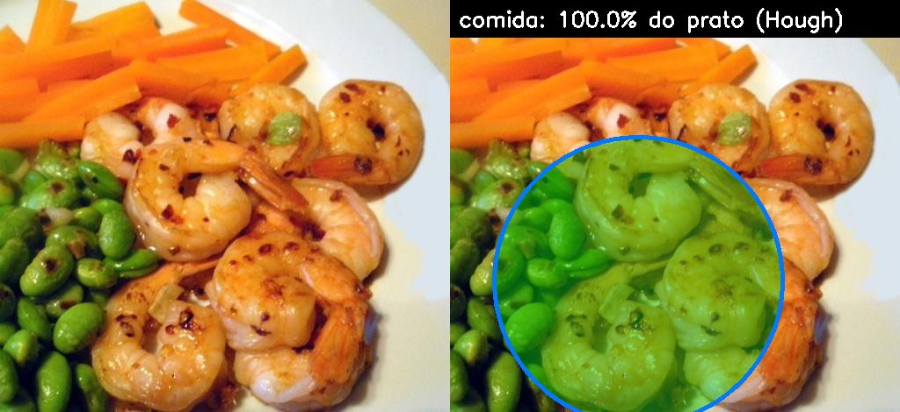

# 🍽️ food-plate-vision

**Estimativa da quantidade de comida em um prato a partir de uma foto**, expressa como
porcentagem da área do prato ocupada por comida. O modelo roda 100% localmente.

> Trabalho da disciplina **Processamento de Sinais 2** — CEFET-RJ
> **Aluno:** Gabriel Videla Figueiredo · **Professor:** Gabriel Matos Araujo


*Saída do pipeline: máscara de comida (verde), borda do prato via transformada de Hough (azul) e porcentagem calculada (imagem de validação do pipeline, com modelo parcialmente treinado e limiar de confiança reduzido).*

## 📐 Como funciona

O sistema combina **deep learning** com **processamento clássico de sinais** em três etapas:

```
foto ──► [1] YOLOv8-seg fine-tunado ──► máscara binária de comida
     ──► [2] Transformada de Hough  ──► círculo do prato (centro, raio)
         [3] quantidade = pixels de comida ∩ prato / área do prato
```

1. **Segmentação da comida (deep learning)** — um [YOLOv8n-seg](https://docs.ultralytics.com/tasks/segment/)
   fine-tunado no dataset [FoodSeg103](https://huggingface.co/datasets/EduardoPacheco/FoodSeg103)
   produz a máscara binária de tudo que é comida na imagem. As 103 classes originais do dataset
   são colapsadas numa classe única `food`, já que o objetivo é medir **quantidade**, não
   identificar o alimento.
2. **Detecção do prato (processamento clássico)** — a borda do prato é encontrada com a
   **transformada de Hough circular** (`cv2.HoughCircles`): suavização por **filtro de mediana**,
   detecção de bordas por gradiente (**Canny**) e votação no espaço de parâmetros (centro, raio).
   Se nenhum círculo plausível é encontrado (prato fora de quadro), a imagem inteira é usada
   como referência e o resultado indica isso.
3. **Quantificação** — a razão entre a área da máscara de comida dentro do prato e a área do
   prato dá a porcentagem final, desenhada sobre a imagem junto com as máscaras.

## 🗂️ Dataset

- **[FoodSeg103](https://huggingface.co/datasets/EduardoPacheco/FoodSeg103)**: 7.118 imagens de
  comida com máscaras de segmentação pixel a pixel (4.983 treino / 2.135 validação, 103 classes).
- O script de preparação baixa o dataset do Hugging Face, binariza as máscaras
  (comida / não-comida) e converte cada região em polígonos normalizados no formato YOLO-seg
  (`cv2.findContours` + `cv2.approxPolyDP`).

## ⚙️ Setup

Pré-requisitos: Windows/Linux com GPU NVIDIA (testado numa RTX 2060 Super 8GB) e
[uv](https://docs.astral.sh/uv/) instalado (`pip install uv`).

```powershell
git clone https://github.com/Zetsugaten/food-plate-vision.git
cd food-plate-vision
uv sync   # cria o ambiente: Python 3.12 + PyTorch CUDA 12.6 + Ultralytics
```

## 🚀 Uso

```powershell
# 1. Baixa o FoodSeg103 e converte para o formato YOLO-seg (~7k imagens)
uv run python scripts/download_dataset.py

# 2. Fine-tuna o YOLOv8n-seg (~2h numa RTX 2060 Super, 50 épocas)
uv run python scripts/train.py

# 3. Roda em uma foto ou pasta de fotos; salva visualizações em outputs/
uv run python scripts/predict.py minha_foto.jpg
uv run python scripts/predict.py pasta_de_fotos/ --conf 0.25
```

Para um teste rápido de ponta a ponta antes do treino completo:

```powershell
uv run python scripts/download_dataset.py --limit 40
uv run python scripts/train.py --epochs 2
uv run python scripts/predict.py data/foodseg103/images/val --conf 0.01
```

## 📊 Treinamento

| Parâmetro | Valor |
|---|---|
| Modelo base | YOLOv8n-seg (3,26 M parâmetros, 11,3 GFLOPs) |
| Dataset | FoodSeg103, classe única `food` |
| Resolução | 640 × 640 |
| Épocas / batch | 50 / 8 |
| Hardware | RTX 2060 Super (8 GB), CUDA 12.6 |

As métricas (mAP de caixa e de máscara), curvas de perda e checkpoints ficam em
`runs/food-seg/` após o treino.

## 📁 Estrutura

```
scripts/download_dataset.py  # baixa FoodSeg103 e converte máscaras -> polígonos YOLO
scripts/train.py             # fine-tuning do YOLOv8n-seg (classe única "food")
scripts/predict.py           # inferência: máscara + Hough do prato + % calculada
relatorio/relatorio.tex      # relatório completo em LaTeX
docs/                        # imagens da documentação
data/                        # dataset convertido (gerado, não versionado)
runs/                        # checkpoints e métricas do treino (gerado, não versionado)
outputs/                     # visualizações lado a lado (gerado, não versionado)
```

## 🔬 Conexões com Processamento de Sinais

- **Transformada de Hough**: detecção paramétrica de formas via acumulação de votos no espaço
  de parâmetros (centro e raio); usa internamente o detector de bordas de Canny, baseado no
  gradiente da imagem.
- **Filtro de mediana**: filtragem não linear para supressão de ruído impulsivo antes da Hough.
- **CNNs como bancos de filtros**: as camadas convolucionais do YOLO são filtros 2D aprendidos —
  a mesma convolução estudada na disciplina, com kernels otimizados por gradiente descendente.
- **Segmentação como sinal 2D**: a máscara é um sinal binário bidimensional cuja soma (integral
  discreta) é a medida de área usada na quantificação.

O desenvolvimento completo está documentado no [relatório em LaTeX](relatorio/relatorio.tex).

## ⚠️ Limitações conhecidas

- A medida é **bidimensional**: não captura a altura da comida no prato (uma montanha de arroz
  e uma camada fina com a mesma projeção dão o mesmo percentual).
- A transformada de Hough assume prato **circular e razoavelmente completo no quadro**; em
  closes ou pratos não circulares o sistema recua para usar a imagem inteira como referência.
- O FoodSeg103 tem muitas fotos em close; para melhores resultados na detecção do prato, use
  fotos com o prato inteiro visível.
